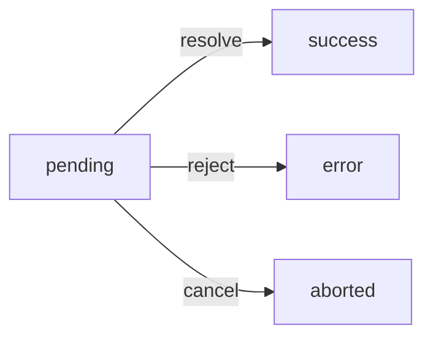

`TaskQueue` is a singleton class that tracks named asynchronous tasks. Each task is identified by a unique string ID, so submitting the same task twice (e.g. a user double-clicking a save button) is blocked with an alert instead of firing a duplicate request.

Tasks communicate their lifecycle status — pending, success, or error — through a linked `ArthaMessage` element.

## TaskQueue.singleton()

Returns the single shared `TaskQueue` instance. Creates it on the first call.

```javascript
import TaskQueue from './src/core/TaskQueue.js';

const queue = TaskQueue.singleton();
```

<Note>
  Always use `TaskQueue.singleton()` rather than `new TaskQueue()` to ensure there is only one queue tracking active tasks across the entire application.
</Note>

## TaskQueue#loadTask(id, title, callback, options)

Registers a new task and immediately executes `callback`. Returns a `TaskQueueItem`, or `null` if a task with the same `id` is already running.

<ParamField path="id" type="string" required>
  Unique identifier for this task. If a task with this ID is already in the queue, an alert is shown and `null` is returned.
</ParamField>

<ParamField path="title" type="string | null" required>
  Label shown in the linked `ArthaMessage` element while the task is pending. Pass `null` to use the default from `Config.get("task_queue.title")`.
</ParamField>

<ParamField path="callback" type="function" required>
  Executed immediately with the `TaskQueueItem` as its only argument. This is where you perform the async work (typically an XHR call) and eventually call `task.resolve()` or `task.reject()`.
</ParamField>

<ParamField path="options" type="object" default="{}">
  Optional overrides merged with `Config.get("task_queue")` defaults.

  | Key | Type | Default | Description |
  |-----|------|---------|-------------|
  | `title` | `string` | `"Petición en proceso..."` | Pending status label (overridden by the `title` argument when non-null). |
  | `close` | `boolean` | `false` | When `true`, the message element is removed 2.5 s after the task finalizes. |
  | `message` | `string \| ArthaMessage \| null` | `null` | Element ID string or `ArthaMessage` instance used for status display. |
</ParamField>

## TaskQueueItem lifecycle



When `loadTask()` registers a task, the item begins in the `pending` state and shows a warning-style message in the linked `ArthaMessage` element. The callback is executed synchronously.

The task transitions to `success` or `error` when `resolve()` or `reject()` is called, and `onFinalize` runs to remove the task from the queue.

## TaskQueueItem methods

### resolve(data, callback)

Fulfills the task's internal promise with `data`. The item processes the response, updates the linked `ArthaMessage`, sets `status` to `"success"`, and invokes `onFinalize`.

<ParamField path="data" type="XMLHttpRequest | Blob | object" required>
  The response to process. Typically the `XMLHttpRequest` object from an XHR callback, a `Blob` for file downloads, or a plain JSON object. When passing an XHR object, the item reads `data.status` to validate the HTTP status code and `data.response` for the body.
</ParamField>

<ParamField path="callback" type="function">
  Optional callback invoked after the response is successfully processed. Receives the parsed JSON body (or `Blob`) as its argument.
</ParamField>

### reject(error)

Rejects the task's internal promise with `error`. The linked `ArthaMessage` displays the error message, `status` is set to `"error"`, and `onFinalize` runs.

<ParamField path="error" type="Error | string" required>
  The error to surface. When an `Error` object is provided, `error.message` is shown in the `ArthaMessage` element.
</ParamField>

### cancel()

Aborts the underlying `XMLHttpRequest` if one was stored on `task.xhr`. Does nothing when no XHR reference exists.

```javascript
task.cancel();
```

## onFinalize callback

`TaskQueue` assigns `task.onFinalize` automatically after creating the item. It:

1. Removes the task ID from the active queue (allowing the same ID to be used again).
2. Removes the `ArthaMessage` element after 2.5 s when `options.close` is `true`, or immediately when called with `remove = true`.

You do not need to set `onFinalize` yourself — it is managed by `TaskQueue`.

## Examples

### Basic XHR task

```javascript
import TaskQueue from './src/core/TaskQueue.js';
import XHR from './src/core/XHR.js';

const queue = TaskQueue.singleton();

queue.loadTask(
  'save-profile',            // unique ID
  'Saving profile...',       // pending label
  (task) => {
    task.xhr = XHR.request({
      method: 'POST',
      uri: 'api/profile',
      data: { name: 'Alice', email: 'alice@example.com' },
      onLoad: (xhr) => task.resolve(xhr),
      onError: () => task.reject(new Error('Network error'))
    });
  },
  { message: 'profile-message', close: true }
);
```

### Preventing duplicate submissions

```javascript
document.querySelector('#save-btn').addEventListener('click', () => {
  const task = queue.loadTask(
    'save-profile',
    'Saving...',
    (task) => { /* ... */ }
  );

  if (!task) {
    // null means the task was already in-flight — the user was alerted automatically
    return;
  }
});
```

### File download (Blob response)

```javascript
queue.loadTask(
  'export-csv',
  'Exporting data...',
  (task) => {
    task.xhr = XHR.request({
      uri: 'api/export',
      response_type: 'blob',
      onLoad: (xhr) => task.resolve(xhr, (blob) => {
        const url = URL.createObjectURL(blob);
        const a = document.createElement('a');
        a.href = url;
        a.download = 'export.csv';
        a.click();
        URL.revokeObjectURL(url);
      }),
      onError: () => task.reject(new Error('Export failed'))
    });
  }
);
```

### Cancelling a task

```javascript
let currentTask = null;

currentTask = queue.loadTask(
  'long-running-report',
  'Generating report...',
  (task) => {
    task.xhr = XHR.request({
      uri: 'api/report',
      onLoad: (xhr) => task.resolve(xhr),
      onError: () => task.reject(new Error('Failed'))
    });
  }
);

// Cancel from a "Stop" button:
document.querySelector('#cancel-btn').addEventListener('click', () => {
  currentTask?.cancel();
});
```

### Using the `close` option

```javascript
queue.loadTask(
  'send-email',
  'Sending...',
  (task) => {
    task.xhr = XHR.request({
      method: 'POST',
      uri: 'api/email/send',
      data: { to: 'bob@example.com', subject: 'Hello' },
      onLoad: (xhr) => task.resolve(xhr),
      onError: () => task.reject(new Error('Send failed'))
    });
  },
  { close: true, message: 'email-status' }
  // The #email-status ArthaMessage element disappears 2.5 s after completion
);
```
